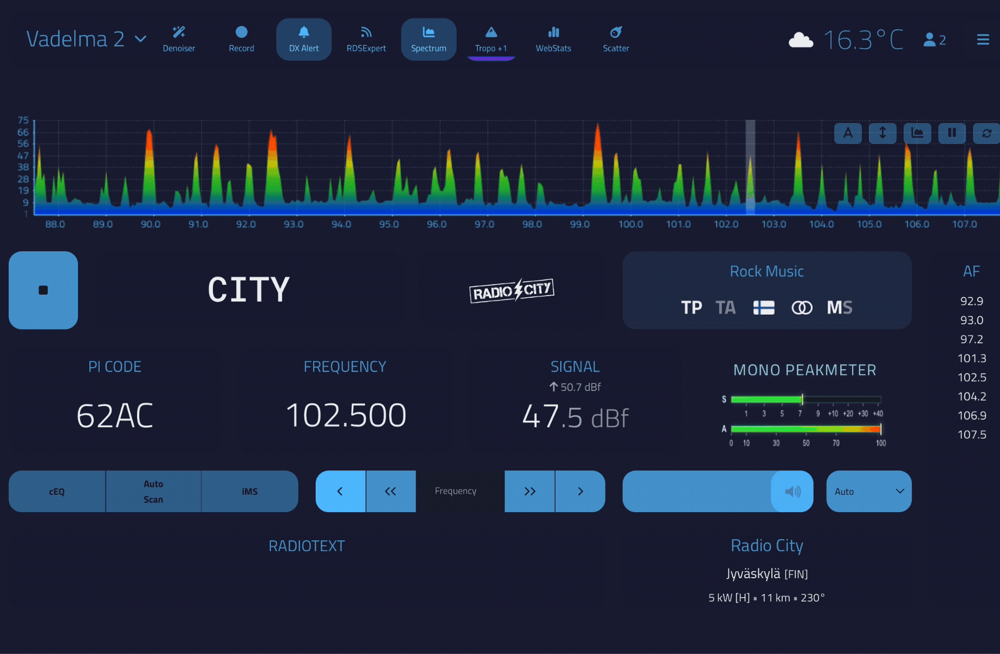

# FM-DX Webserver Mono Peakmeter

A compact RF/audio peak meter plugin for FM-DX Webserver with a modern broadcast monitor inspired design.

## Features

- Live RF signal meter
- Live audio modulation meter
- Peak hold indicators
- CLIP indicator
- Smooth interpolation and animation
- Gradient meter bars with glow effects
- Native FM-DX Webserver UI integration
- Optimized for mono DX monitoring
- Lightweight canvas based rendering

## Installation

1. Download the latest release from the Releases page
2. Extract the plugin into your FM-DX Webserver `plugins` directory
3. Restart FM-DX Webserver

## Planned Features

- Stereo / mono detection
- Stereo pilot detection
- Theme awareness
- Compact mode
- Tune Panel integration
- Broadcast processor style skins
- Additional visual themes

## Support

If you like this project and want to support development:

[Buy Me a Coffee](https://buymeacoffee.com/jannedx)

## License

MIT